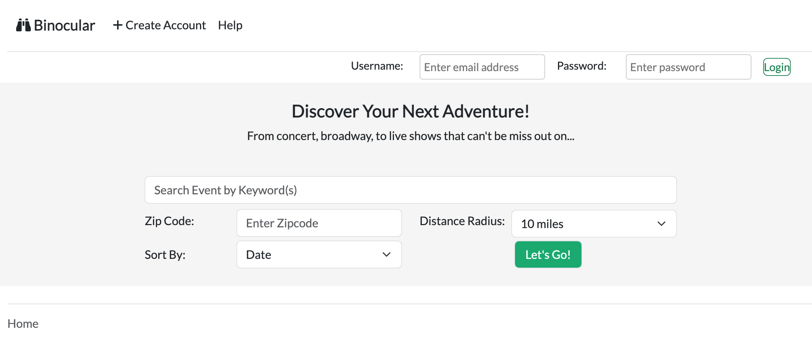
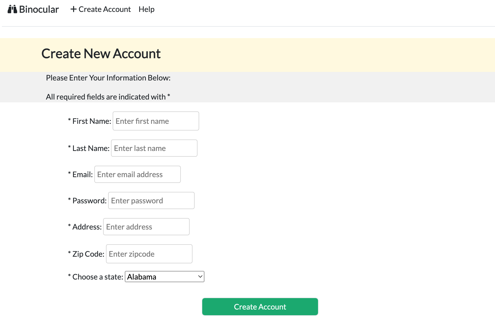
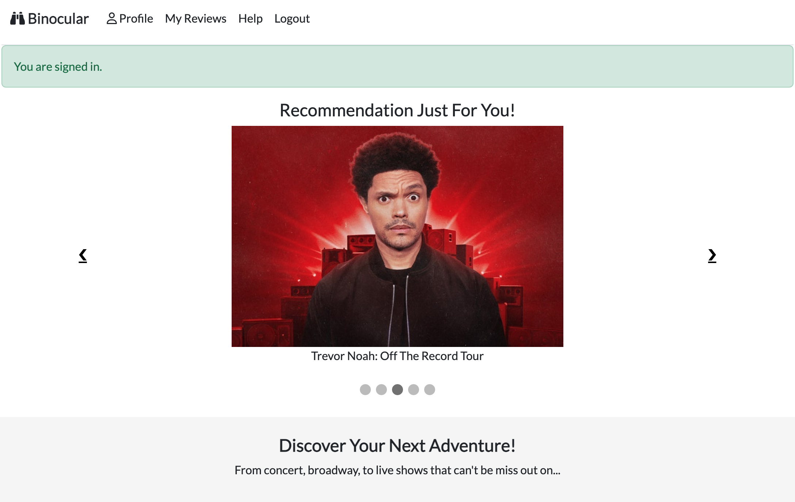
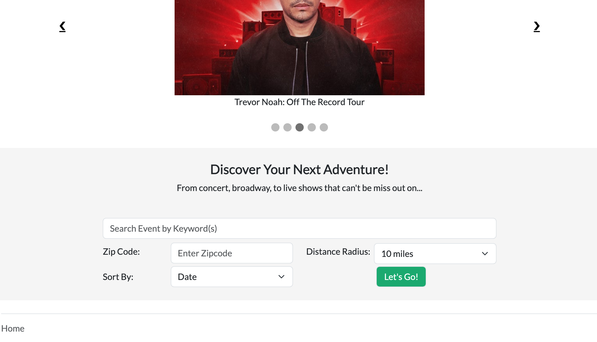
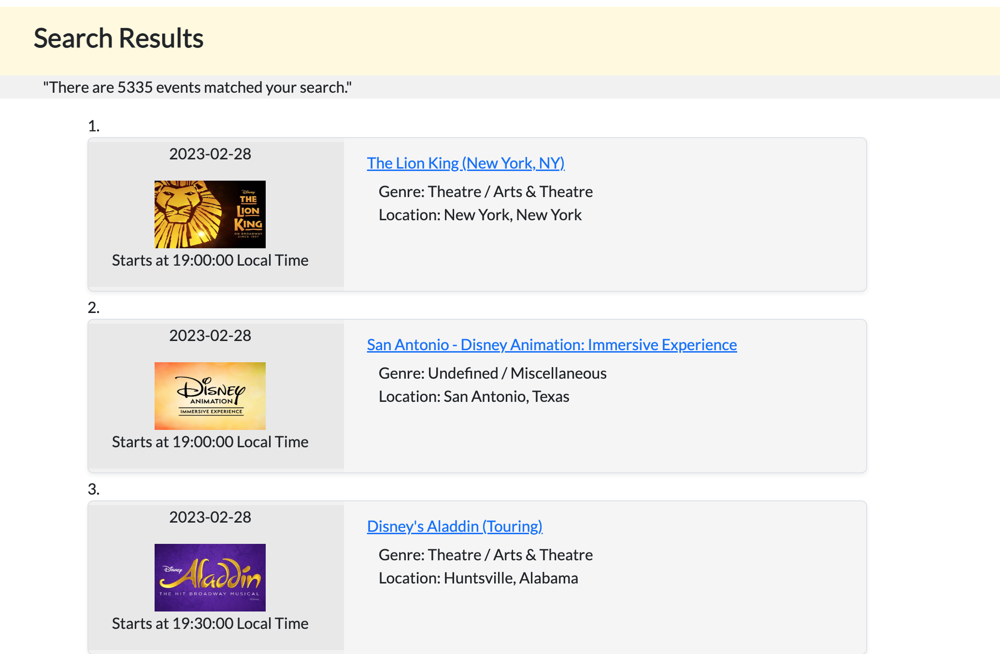
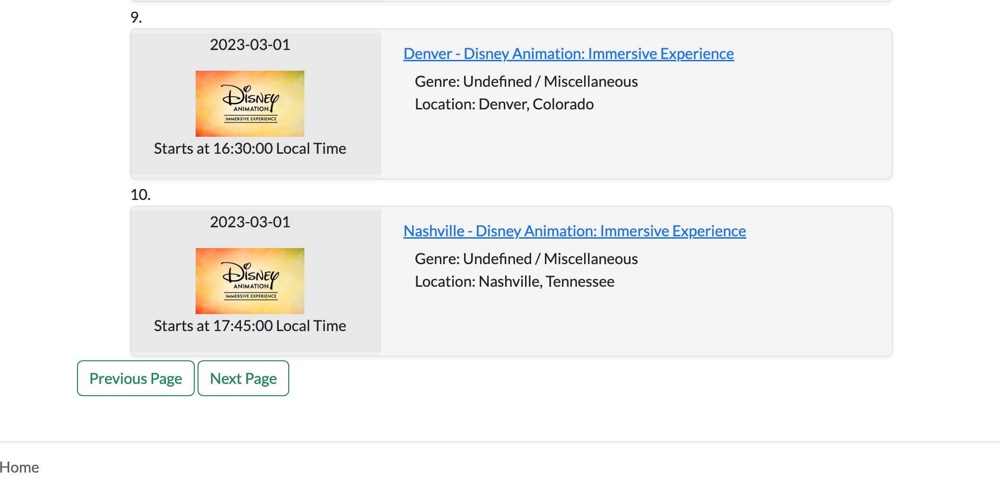
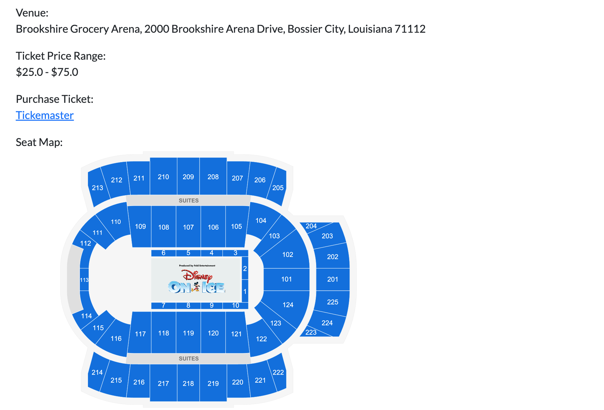
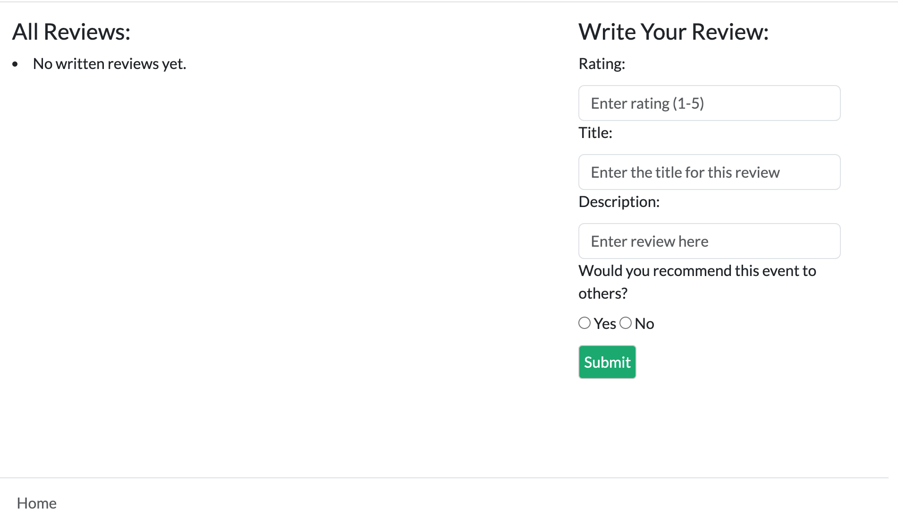
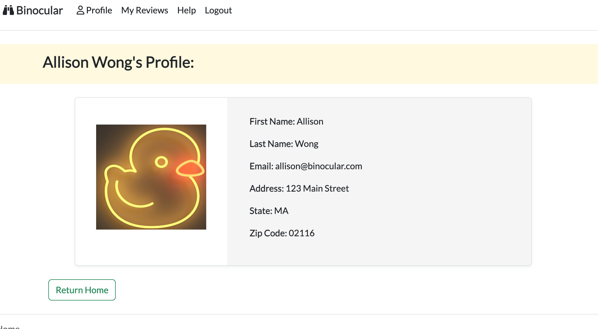
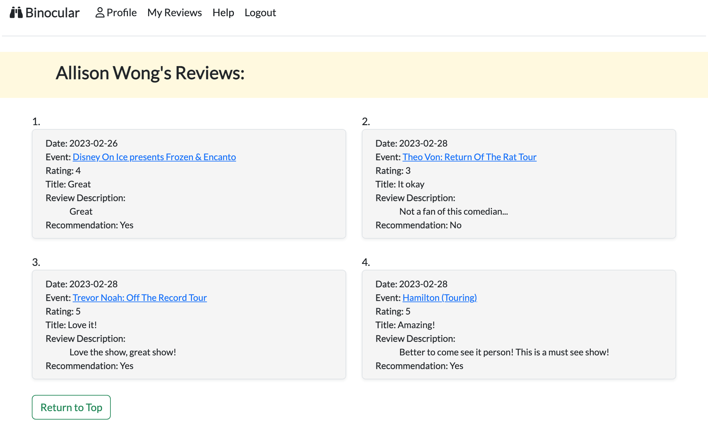

# Binocular
Binocular is a site intended to help user discover new events happening near them and provide reviews for others. Based on user's preferences, search engine will return a list of events and provide further information such as event's genre, date and location to find their next adventure. The purpose of this project is to help student to demostrate the basic coding skills learned from Hackbright and apply it using an existing database from Ticketmaster API in 4 weeks of time.

Table of Contents
* [Technologies Used](#technologies)
* [Features](#features)
* [How to use Binocular?](#use)
* [Author](#author)

## Technologies Used
* Python
* Flask
* PostgresSQL
* SQLAlchemy
* JavaScript
* AJAX/JSON
* Jinja2
* CSS/Bootstrap
* HTML
* Ticketmaster API
* Google Maps API

## Features
1. Create new user account
2. View user profile
3. View all user written reviews
4. Search for events using different filters
5. Access specific event information
6. Add and edit review for event
7. Log-out

## How to use Binocular?
### To use Binocular, user is encourage to create a new account to gain access to all features.

### Enter keyword(s), zip code and/or radius in search bar, then click `Let's go!`. 

A list of results will return by Ticketmaster API. Each page will display a maxium of 10 events at a time. `Next Page` and `Previous Page` buttons will also be available for interact when search results is greater than 10.

### Click a title of event will query the database and display more specific information for user to see.

### To purchase a ticket, there are 2 options. Depending availability, page will either direct user to Ticketmaster webpage or to an indiviual box office webpage.

### Log-in user can view all, add or edit existing review at the bottom of each event page.

### If user clicked on `Profile` or `My Reviews` at the top navigation bar, it will display their user profile and all reviews this user has posted sorted by its written date.

## Author
Allison Wong is a software engineer in Boston, MA and the creator of Binocular. She is available to connect via GitHub and LinkedIn when visit her profile.
